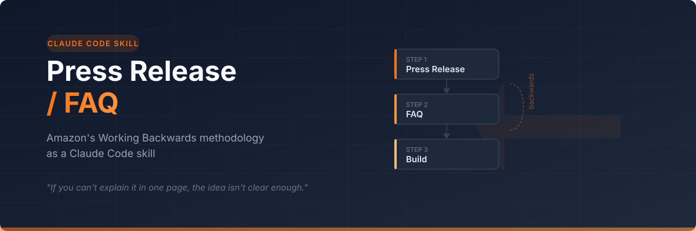

<p align="center">
  
</p>

<p align="center">
  <a href="#installation"><strong>Install</strong></a> ·
  <a href="#usage"><strong>Usage</strong></a> ·
  <a href="#template-structure"><strong>Template</strong></a> ·
  <a href="#background-working-backwards"><strong>Background</strong></a>
</p>

---

A [Claude Code](https://docs.anthropic.com/en/docs/claude-code) skill that guides you through Amazon's **Working Backwards** methodology — the PR/FAQ framework used to launch products like Kindle, AWS, and Alexa.

Instead of starting with specs or mockups, you start with a 1-page press release written as if the product already shipped. Then you answer the hardest questions in a structured FAQ. If the press release isn't compelling, the idea needs more work — and you've saved weeks of building the wrong thing.

---

## What You Get

- **Guided discovery** — Claude asks targeted questions about your customer, their pain points, and your differentiation before writing anything
- **1-page press release** — Headline, problem, solution, leader quote, how it works, customer quote, and call to action
- **Structured FAQ** — External (customer/journalist questions) and internal (stakeholder/leadership questions) sections
- **Iteration loop** — Claude helps you sharpen the press release and plug gaps in the FAQ until the document stands on its own
- **Markdown output** — Clean, portable document saved to your project

---

## Installation

### Claude Code (recommended)

Clone and symlink into your skills directory:

```bash
git clone https://github.com/gdespirito/press-release-skill.git ~/.local/share/press-release-skill

mkdir -p ~/.claude/skills
ln -sf ~/.local/share/press-release-skill ~/.claude/skills/press-release
```

### Manual copy

```bash
mkdir -p ~/.claude/skills/press-release
curl -fsSL https://raw.githubusercontent.com/gdespirito/press-release-skill/main/SKILL.md -o ~/.claude/skills/press-release/SKILL.md
mkdir -p ~/.claude/skills/press-release/templates
curl -fsSL https://raw.githubusercontent.com/gdespirito/press-release-skill/main/templates/prfaq.md -o ~/.claude/skills/press-release/templates/prfaq.md
```

### Project-level installation

If you want the skill available only within a specific project:

```bash
cd your-project
mkdir -p .claude/skills/press-release
cp -r ~/.local/share/press-release-skill/* .claude/skills/press-release/
```

---

## Usage

The skill activates automatically when you mention press releases, PR/FAQ, or Working Backwards:

```
> I want to write a press release for a new photo sharing feature
> Let's do a PR/FAQ for our API redesign
> Working backwards — I have an idea for a notification system
```

Claude will:

1. **Ask discovery questions** — customer, problems, differentiation, timing
2. **Draft the press release** — following the 1-page constraint
3. **Review and iterate** — sharpen language, cut fluff, strengthen the problem statement
4. **Draft the FAQ** — external and internal questions with honest answers
5. **Save the document** — as markdown in your project

---

## Template Structure

The skill includes a complete PR/FAQ template with these sections:

### Press Release (1 page max)
| Section | Purpose |
|---------|---------|
| Headline | Company + Product + Customer + Benefit |
| Subtitle | One sentence expanding on the headline |
| Introduction | What, who, key benefit (3-4 sentences) |
| Problem | 2-3 customer pain points — no solution mentioned |
| Solution | How it addresses each problem, differentiation |
| Leader Quote | Why the company chose to solve this |
| How It Works | Step-by-step customer experience |
| Customer Quote | Named persona: pain before, relief after |
| Call to Action | How to get started |

### FAQ
| Section | Covers |
|---------|--------|
| External | Pricing, platforms, security, limitations, differentiation |
| Internal | Market size, costs, timeline, risks, metrics, dependencies |

---

## Background: Working Backwards

The PR/FAQ methodology was developed at Amazon around 2004 when Jeff Bezos banned PowerPoint and replaced it with written narratives. The framework was later documented by Colin Bryar and Bill Carr in *Working Backwards: Insights, Stories, and Secrets from Inside Amazon* (2021).

**Core idea:** Start with the customer announcement and work backwards to what you need to build. If the press release doesn't excite anyone, don't build it.

**Key principles:**
- Customer obsession — every section written from the customer's perspective
- One page constraint — forces ruthless prioritization
- Problem before solution — the problem must be compelling on its own
- Truth-seeking, not selling — the FAQ addresses the hardest questions honestly

---

## Contributing

Found a way to improve the workflow? PRs are welcome. Some ideas:

- Adapting the template for specific contexts (open source, internal tools, startups)
- Adding more discovery questions for specific domains
- Translations

---

## Like this skill?

If you found this useful, consider giving it a star — it helps others discover it and motivates continued development.

**[Give it a star on GitHub](https://github.com/gdespirito/press-release-skill)**

---

## License

MIT
