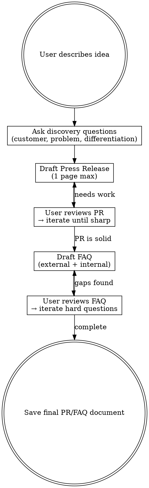

# Working Backwards: Press Release / FAQ

Write a future press release before building anything. If you can't explain the customer value in one page, the idea isn't clear enough.

## When to Use

- Validating a new product or feature idea before implementation
- Clarifying product vision and customer value proposition
- Aligning stakeholders on what to build and why
- Deciding between competing feature ideas (write a PR/FAQ for each)

**Don't use for:** bug fixes, refactors, technical debt, or work where the customer value is already obvious.

## Core Principles

1. **Customer obsession** — every section is written from or for the customer
2. **One page constraint** — the press release MUST be ~500-600 words max
3. **Problem before solution** — if the problem isn't compelling, nothing else matters
4. **Truth-seeking, not selling** — the FAQ honestly addresses the hardest questions
5. **One customer segment** — each PR/FAQ targets exactly one audience
6. **Write before building** — this document precedes all code, design, or development

---

## Workflow

### Step 1: Discovery Questions

Before writing anything, ask the user these questions (adapt based on context):

**Essential (always ask):**
- Who is the target customer? Be specific (not "everyone").
- What are 2-3 specific problems or pain points they face today?
- How do they currently solve these problems? (Existing alternatives)
- What would make them switch to your solution?

**Clarifying (ask if not obvious):**
- Why now? What changed to make this the right time?
- How will you measure success? What metrics matter?
- What is explicitly OUT of scope?

Do NOT proceed to drafting until the customer and problem are clear.

### Step 2: Draft Press Release

Write the press release following the template in `templates/prfaq.md`. Key rules:

- **~500-600 words max** — if it doesn't fit in one page, cut ruthlessly
- **Headline formula:** "[Company] Announces [Product] to Enable [Customer] to [Benefit]"
- **Problem paragraph comes before solution** — no solution mentioned until problems are established
- **Customer quote must be specific** — pain before, relief after, with concrete details
- **Leader quote explains WHY** the company chose to solve this problem

Present the draft to the user. Iterate until the press release is sharp and compelling.

### Step 3: Draft FAQ

Once the press release is solid, draft the FAQ with two sections:

**External FAQs** (what customers/journalists would ask):
- Pricing, availability, platforms
- How it works technically
- Differentiation from alternatives
- Limitations and constraints
- Data privacy/security

**Internal FAQs** (what stakeholders/leadership would ask):
- Target market size and customer definition
- Current alternatives and switching motivation
- Development cost and timeline estimate
- Biggest risks (technical, market, execution)
- Key metrics and success criteria
- Why now? What happens if we don't build this?
- Dependencies on other teams or services

The FAQ is where rigor lives. Don't dodge hard questions.

### Step 4: Save Document

Save the final PR/FAQ to `docs/prfaq/[product-name].md` using the template structure.

---

## Common Mistakes

| Mistake | Fix |
|---------|-----|
| Selling instead of truth-seeking | The goal is to evaluate the idea, not pitch it |
| Vague problem statement | Name 2-3 specific, painful customer problems |
| Ignoring competition | Customers always have alternatives — explain why they'd switch |
| Press release exceeds 1 page | Unclear thinking. Cut until it fits. |
| Multiple customer segments | One PR/FAQ per segment. Split if needed. |
| Generic customer quote | Must reference specific pain and specific relief |
| Missing "Why now?" | Explain what changed — market, technology, or customer behavior |
| FAQ dodges hard questions | Address the toughest objections head-on |

---

## Output Format

The document is saved as markdown following the template in `templates/prfaq.md`. It must be readable in silence without any verbal explanation — this is the core design principle of Working Backwards.
